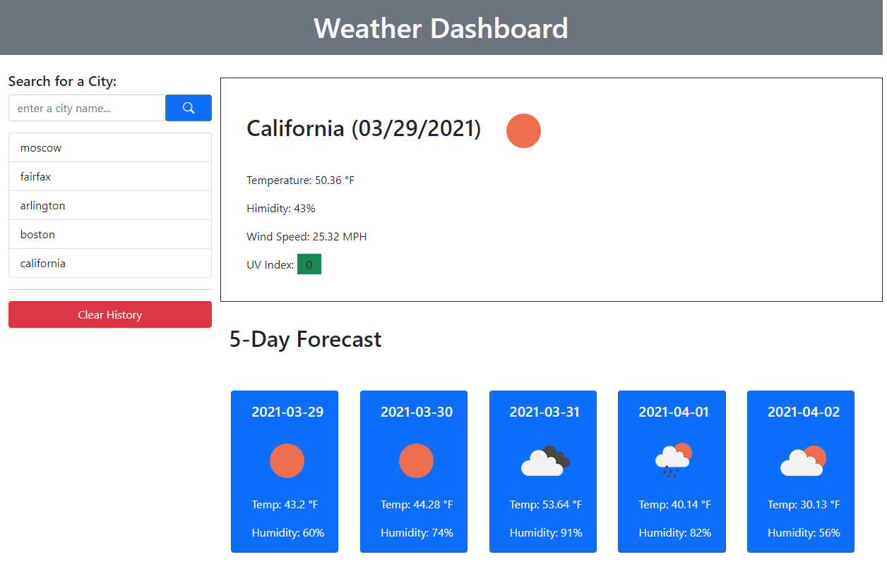

# Weather App
  
   
  ## Table of Contents:
  

  * [Description](#description)
  * [Installation instructions](#InstallationInstructions)
  * [Usage](#Usage)
  * [Contributors](#Contributors)
  * [Tests](#Tests)
  * [License](#License)
  * [Questions](#Questions)

    
  
    
  ## [Description](#description)
  

  This app will take zip code or address and generates weather forecast for current and plus 5 days.
    
  ## [Installation instructions](#InstallationInstructions)
  

  All tools come with added dependencies
    
  ## [Usage](#Usage)
  

  Input zip code or city name and click Search button
    
  ## [Contributors](#Contributors)
  

  Only myself
    
  ## [Tests](#Tests)
  

  No tests were included at the moment, but added a sceenshot of previous run
   
  
    
  ## [License](#License)
  

  Copyright (c) Kuba Z Production. All rights reserved.
	Licensed under the The MIT License.
    
  ## [Questions](#Questions)
  

  If any questions dont hesitate to reach out.  
  Github username: kZhaanbaev  
  email: k.Zhaanbaev4@gmail.com
