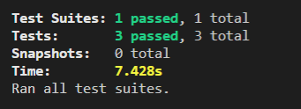

# README.md Generator

  ## Table of Contents:

  * [Description](#description)
  * [Installation instructions](#InstallationInstructions)
  * [Usage](#Usage)
  * [Contributors](#Contributors)
  * [Tests](#Tests)
  * [License](#License)
  * [Questions](#Questions)

    
  
    
  ## [Description](#description)

  This application will prompt number of questions to user in colsole and based on the answers will generate a README.md file. Optional add screenshot feature is included as well in case user wants to add a screenshot of his/her application or test scenarios.
    
  ## [Installation instructions](#InstallationInstructions)

  To install the packages run "-npm i" command  
  
    
  ## [Usage](#Usage)

 To start the application run "-node index.js".  
 Most of the questions require answers in text format.  
 Screenshot related questions need Yes (Y) or No (N) answers.
 There are only 2 screenshots included at the moment.  
 If user wants to add their screenshot, paste it to utils package and rename it as "mainScreenshot.png" or "testScreenshot/png" based on what type of screenshot it is.
    
  ## [Contributors](#Contributors)

  Only myself for now
    
  ## [Tests](#Tests)

  Adding a screenshot of sample test.  
   
  
    
  ## [License](#License)

  Copyright (c) Kuba Z Production. All rights reserved.
    
  ## [Questions](#Questions)

  If any questions dont hesitate to reach out.  
  Github username: [kZhaanbaev](https://github.com/kZhaanbaev)  
  email: k.zhaanbaev4@gmail.com
